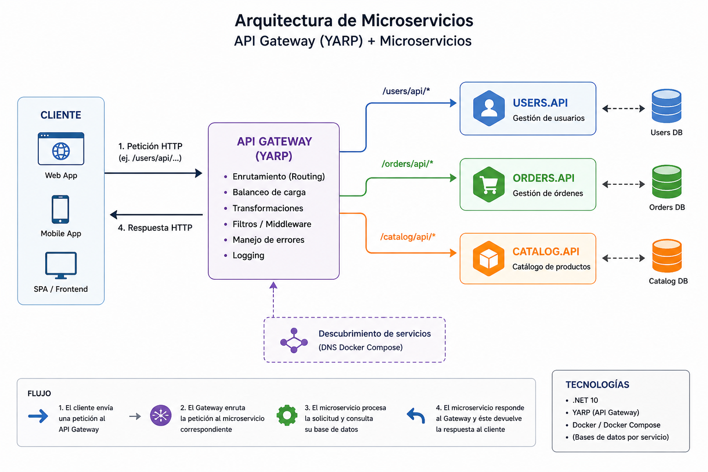

# Ejemplo de reverse proxy con YARP
Las peticiones entran por Gateway.Api y se encarga de redigir al microservicio pertinente haciendo match con la ruta.


```
Frontend / Cliente
      ↓
 Gateway.Api (YARP)
      ↓
 ┌────────────┬────────────┬────────────┐
 │ Users.Api  │ Orders.Api │ Catalog.Api│
 └────────────┴────────────┴────────────┘

```



En el appsettings se configuran las rutas y los clusters


```json
    "ordersRoute": {
        "ClusterId": "ordersCluster", // cluster o microservio de orders
        "Match": {
          "Path": "/orders/{**catch-all}" //catch de todo lo que hay despues de /orders/, es decir el /api/orders
        },
        "Transforms": [
          { "PathRemovePrefix": "/orders" }   // Quitar orders para que solo envie al api correspondiente api/orders
        ]
      },


// definicion de los clusters y sus rutas
 "ordersCluster": {
        "Destinations": {
          "d1": {
            "Address": "http://localhost:5102/"
          }
        }
      },

```

## Auth

Si se quiere agregar un Identity Provider como Keycloak, cada api deberá validar el token. Esto es asi porque si conoces el puerto del api se podrian colar peticiones y estas deberin venir con el token válido.

## Redirecciones

```

http://localhost:5000/users/api/users -> redirige al api de usuarios http://localhost:5001/api/users
http://localhost:5000/orders/api/orders -> redirige al api de orders http://localhost:5002/api/orders
http://localhost:5000/catalog/api/catalog -> redirige al api de orders http://localhost:5003/api/catalog

```
## Ejecución

Levantar cada api
```
dotnet run --project Users.Api
dotnet run --project Orders.Api
dotnet run --project Catalog.Api
dotnet run --project Gateway.Api


docker compose up

```

YArp: 
https://learn.microsoft.com/en-us/aspnet/core/fundamentals/servers/yarp/config-files?view=aspnetcore-10.0


# Parte de CI/CD

Primero hemos agregado la parte de ci en github. Para eso agregamos el directorio .github/workflows/ci.yml


## Primera versión
En esta primera versión simplementa hacemos un CI en github levantando containers y lanzando test

## SEgunda versión

Nota que estamos en la segunda versión . En ella hago un push a mi cuenta de dockerHub


He cambiado el docker compose que se ahora se encuentra en docker-compose-pull.yml porque ahora hace un pull de dockerhub en vez de builder la imagen , lo que se hace en docker-compose.yml para uso local

levantar el servicio, haciendo pull de docker hub

```
docker compose -f docker-compose-pull.yml pull

docker compose -f docker-compose-pull.yml up -d

```

## Tercera versión, agregamos CD

```
GitHub Actions
   ↓
docker build
   ↓
docker push
   ↓
Watchtower detecta nueva imagen
   ↓
docker pull automático
   ↓
reinicia containers

```


Agregamos al docker compose-pull.yml watchtower
````
  watchtower:
    image: containrrr/watchtower
    container_name: watchtower

    volumes:
      - /var/run/docker.sock:/var/run/docker.sock

    command: --interval 30

    restart: always
```